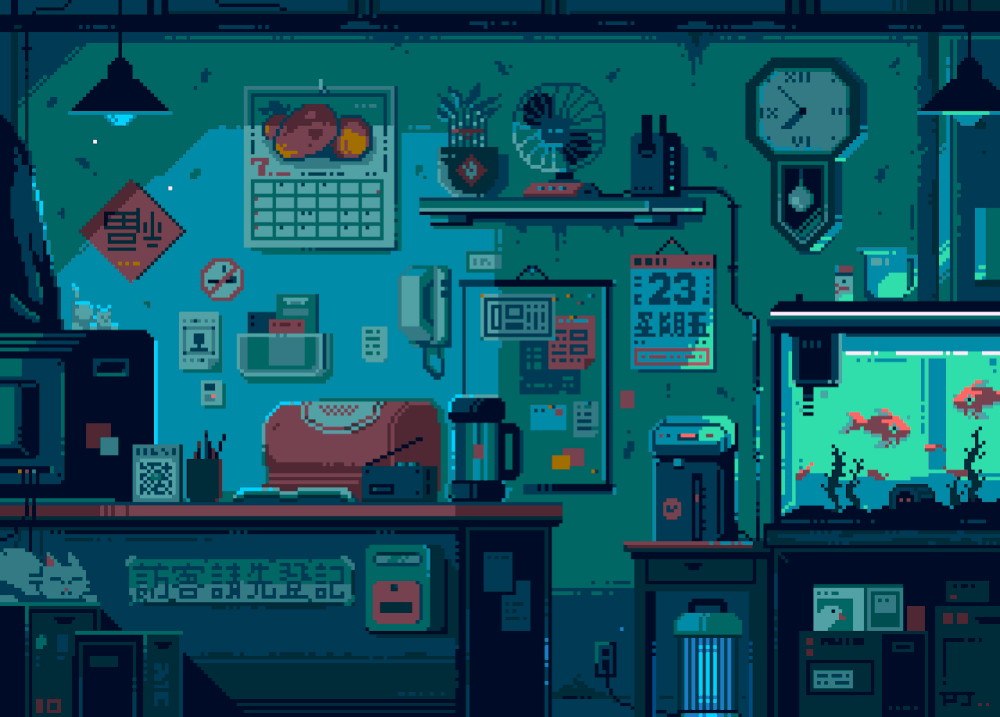

  <!-- visitor counter + choose one hero option (A or B) -->
  

<!-- NAVIGATION -->

  <a href="#about">About</a> •
  <a href="#tech--tools">Tech & Tools</a> •
  <a href="#featured-projects">Featured Projects</a> •
  <a href="#github-stats">Stats</a> •
  <a href="#career-goals">Career Goals</a> •
  <a href="#how-i-work">How I Work</a> •
  <a href="#connect">Connect</a>

  

---

# Hi — I’m Shaurya 👋 (Code.py)  
**Python-first developer • Backend & Data enthusiast • I ship practical projects**

---

## 🔭 About
I’m Shaurya — a developer who likes turning small experiments into tools people can actually use. I started by automating boring tasks, then moved to building web apps and data projects that solve specific problems. I care about readable code, reproducible demos, and shipping things that work in production.

---

## 🧰 Tech & tools

  
  
  
  
  
  
  
  
  
  
  
  
  
  
  

---

## ⭐ Featured projects
- **[ISS_Viewer](https://github.com/Thunderer9506/ISS_Viewer)** — small Python tool showing ISS position & telemetry.  
- **[snake-game](https://github.com/Thunderer9506/snake-game)** — classic Snake; clean game logic and project structure.  
- **[Data-Science](https://github.com/Thunderer9506/Data-Science)** — notebooks & EDA projects showcasing data work.  
- **[Attendance-System](https://github.com/Thunderer9506/Attendance-System)** — face-recognition attendance app (Tkinter + CV).  
- **[BlogDojo](https://github.com/Thunderer9506/BlogDojo)** — deployable Flask blog (rich editor, image upload). Live demo: https://blogdojo.onrender.com

---

## 📈 GitHub stats
<table align="center">
  <tr>
    </td>
    </td>
  </tr>
</table>

<!-- Cool features -->

  <!-- GitHub trophy card -->
  

---

## 🎯 Career goals
- Short term: land a backend / ML-support internship where I can build APIs and ship data-driven features.  
- Mid term: design reliable backend services, learn production ML deployment, and mentor juniors.  
- Open to internships, freelance mini-projects, and ML/API collaborations.

---

## ⚡ How I work
- Small, focused PRs and readable commits.  
- Prefer clear README + demo GIF for every repo.  
- I deploy projects (BlogDojo) to show end-to-end ability.

---

## 📫 Connect
- LinkedIn — https://www.linkedin.com/in/shaurya-srivastava001  
- X — https://x.com/ShauryaSri88742  
- LeetCode — https://leetcode.com/u/shaurya_the_coder/  
- GeeksforGeeks — https://www.geeksforgeeks.org/user/codedotpy/
